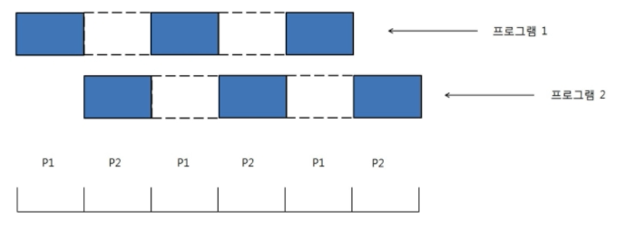
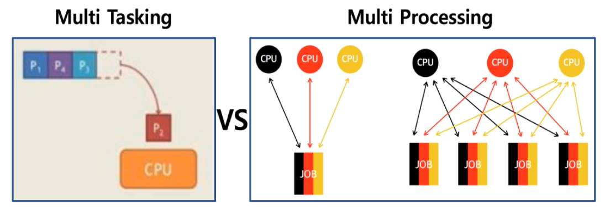

## 프로세스 스케쥴링

### - 배치 처리 시스템, 시분할 시스템, 멀티 태스킹

---

## 배치 처리 시스템

- 자동으로 다음 응용 프로그램이 이어서 실행될 수 있도록 하는 시스템
- **FIFO** (Queue)

---

## 배치 처리 시스템과 시분할 시스템/멀티 프로그래밍

- 배치 처리 시스템은 여러 프로그램을 순차적으로 실행시킬 수 있지만 FIFO 구조로 단점이 있다.
  - 어떤 프로그램은 실행이 너무 시간이 많이 걸려서, 다른 프로그램이 실행하는데 시간을 많이 기다려야 한다.
  - 나는 MP3 음악을 들으면서, 문서 작성을 하고 싶다!! (동시에 여러 응용 프로그램 실행)
  - 여러 사용자가 동시에 하나의 컴퓨터를 쓰려면 어떻게 해야 하나요?? (다중 사용자 지원)

> 멀티 프로그래밍/시분할 시스템이 나왔다.

---

## 시분할 시스템

- 시분할 시스템: 다중 사용자 지원을 위해 컴퓨터 응답 시간을 최소화하는 시스템

---

## 멀티 태스킹

- 멀티 태스킹: 단일 CPU에서 여러 응용 프로그램이 동시에 실행되는 것처럼 보이도록 하는 시스템
  - 나는 MP3 음악을 들으면서 문서 작성을 한다

## 실제 멀티 태스킹

- 1000 밀리초(ms) = 1초
- 10 ~ 20 ms 단위로도 실행 응용 프로그램이 바뀌더라
- 사용자에게는 동시에 실행되는 것 처럼 보임
- 시분할 컨셉과 근본 컨셉이 같음

---

## 멀티 태스킹과 멀티 프로세싱

- 멀티 태스킹과 멀티 프로세싱의 차이

- 멀티 태스킹: 단일 CPU
- 멀티 프로세싱: 여러 CPU에 하나의 프로그램을 병령로 실행해서 실행속도를 극대화 시키는 시스템

---

## 정리

- 배치 처리 시스템
- 시분할 시스템 (다중 사용자 지원, 응답시간 최소화)
- 멀티 태스킹 (동시 실행하는 것 처럼 보이도록)
- 멀티 프로세싱 (여러 CPU에 하나의 프로그램을 병렬로 실행시키는 시스템)
