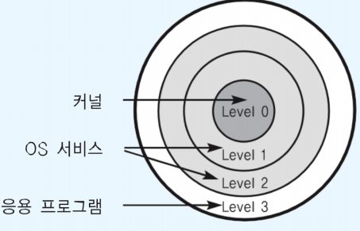
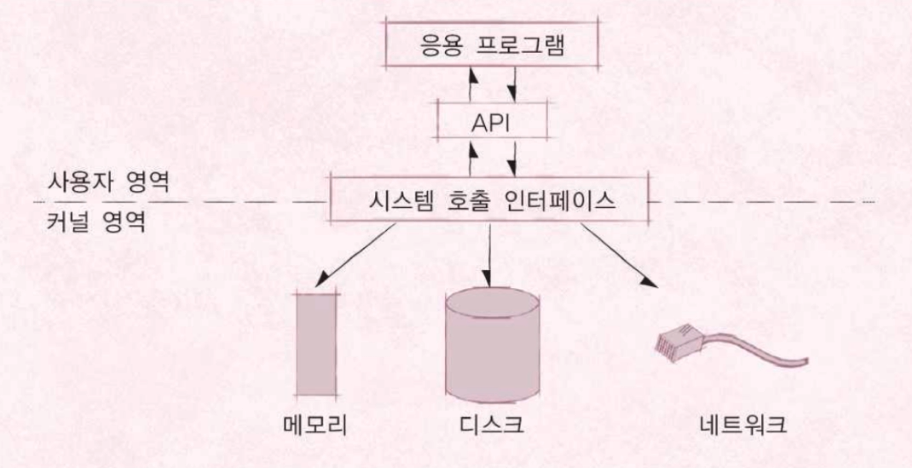
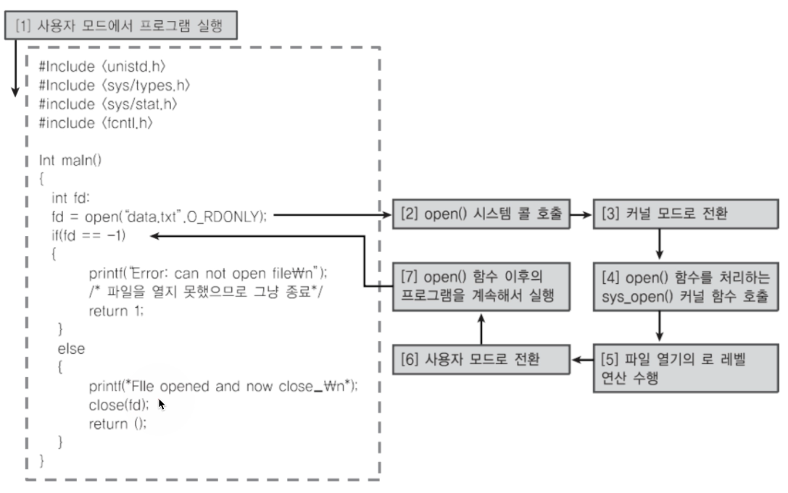
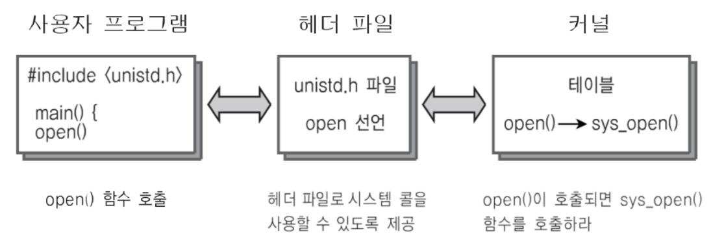

# 운영체제 구조

---

## CPU Protection Rings

- CPU도 권한 모드라는 것을 가지고 있다.
  - 사용자 모드(user mode by applications)
  - 커널 모드(kernel mode by OS): 특권 명령어 실행과 원하는 작업 수행을 위한 자원 접근을 가능케 하는 모드

---

## CPU Protection Rings

### 두 가지 모드

- 사용자 모드 (user mode): 응용프로그램이 사용
- 커널 모드(kernal mode): OS가 사용

---

## 응용프로그램과 운영체제

- 우리가 만드는 프로그램은 맨 위에서 놀고 있다.

---

## 시스템콜은 커널 모드로 실행

- 커널 모드에서만 실행 가능한 기능들이 있음
- 커널 모드로 실행하려면 반드시 시스템 콜을 사용해야 함(거쳐야 함)
- 시스템 콜은 운영체제가 제공

---

## 사용자 모드와 커널 모드

- 함부로 응용 프로그램이 전체 컴퓨터 시스템을 헤치지 못함
- 예) [사용자모드] 주민등록등본은 꼭 동사무소 또는 민원24시(정부 사이트)에서 특별한 신청서(시스템콜)를 써야만 발급
  - [커널모드] 동사무소 직원분들은 특별한 권한을 가지고 주민등록등본 출력 명령을 실행

---

## Code example1

---

## Code example2

---

## 정리

- 운영체제는 **시스템 콜** 제공
- 프로그래밍 언어별로 운영체제 기능을 활용하기 위해, 시스템 콜을 기반으로 **API** 제공
- 응용 프로그램은 운영체제 기능 필요시, 해당 **API**를 사용해서 프로그램을 작성
- 응용 프로그램이 실행되서, 운영체제 기능이 필요한 **API**를 호출하면, 시스템 콜이 호출되서, **커널 모드로 변경되어**, OS 내부에서 해당 명령이 실행되고, 다시 응용 프로그램으로 돌아간다.
